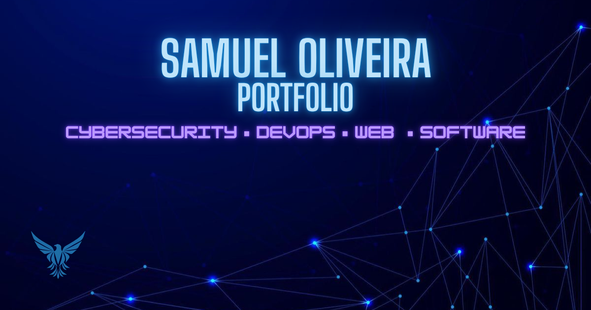

# About Samuel Oliveira

Hi, my name is **Samuel Oliveira**, a cybersecurity enthusiast with a strong foundation in software development, networking, and IT systems. I’ve always been fascinated by how technology works behind the scenes, and that curiosity naturally led me to discover my passion for cybersecurity.

## Who Am I?

I’m a cybersecurity student with a background in programming and databases. I enjoy understanding how systems operate at every level (from application code to network infrastructure) and using that knowledge to make them more secure.  
I’m passionate about learning, solving complex problems, and developing solutions that make technology safer for everyone.

## Why Cybersecurity?

Since I was young, I’ve been curious about what happens “behind the screen.” Over time, that curiosity evolved into a genuine drive to protect systems and people online. What motivates me most is helping others by preventing attacks, safeguarding data, and ensuring that technology is used responsibly and ethically. For me, cybersecurity isn’t just about defense; it’s about **trust, ethics, and continuous learning**.

## What Drives Me?

I’m deeply motivated by curiosity, purpose, and the desire to keep growing, technically and personally. Technology never stops evolving, and I believe neither should we. Every challenge is a new opportunity to learn, adapt, and improve.

## What Am I Working On?

I’m currently focused on strengthening my skills and experience in cybersecurity through both academic and hands-on learning:

- Studying for a **CTeSP in Cybersecurity** at [**ISTEC (Instituto Superior de Tecnologias Avançadas do Porto)**](https://istec-porto.pt), deepening my knowledge in network defense, vulnerability assessment, and secure systems design.  
- Completing the **ARC X Cyber Threat Intelligence 101** certification, developing skills in threat analysis, intelligence gathering, and attacker profiling.  
- Building small tools and scripts to automate repetitive security and system administration tasks.  
- Exploring **DevOps security** and improving secure deployment practices, infrastructure hardening, and monitoring strategies.

## Explore My Work

If you’d like to explore my technical projects, tools, and experiments, visit my [**projects index**](https://github.com/Sam-Ciber-Dev/projects-index).  
It includes my most relevant work in **cybersecurity, web development, networking, programming, and hardware**, all documented with setup notes and summaries.
You can also visit my [**personal website**](https://sam-ciber-dev.github.io) for key resources, certifications, and contact details.

## Contact

- **Email:** sam.oliveira.dev@gmail.com 
- **Compose in Gmail:** [Gmail](https://mail.google.com/mail/?view=cm&fs=1&to=sam.oliveira.dev@gmail.com&su=Portfolio%20inquiry&body=Hi%20Samuel%2C%0A)
- **Compose in Outlook:** [Outlook](https://outlook.live.com/owa/?path=/mail/action/compose&to=sam.oliveira.dev@gmail.com&subject=Portfolio%20inquiry&body=Hi%20Samuel%2C%0A)  
- **LinkedIn:** [linkedin.com/in/jose-samuel-oliveira](https://www.linkedin.com/in/jose-samuel-oliveira)
- **Website:** [sam-ciber-dev.github.io](https://sam-ciber-dev.github.io)

## License

This repository is licensed under the [**MIT License**](LICENSE). See LICENSE for details.

## Social Preview

The social preview image used for link cards:

## Badges

